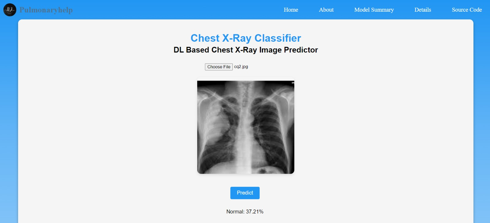

# Chest X-Ray Classifier

Chest X-Ray Classifier is a web application that utilizes the deep learning to classify chest X-ray images. It allows users to upload chest X-ray images and predicts the condition depicted in the image.



## Table of Contents

- [Introduction](#introduction)
- [Features](#features)
- [Installation](#installation)
- [Usage](#usage)
- [Contributing](#contributing)
- [Deployment](#deployment)
- [License](#license)

## Introduction

This project harnesses the power of Deep learning to accurately classify chest X-ray images.It allowing for easy integration and deployment in web applications.

## Features

- Predicts various conditions from chest X-ray images.
- Utilizes a trained model based on a comprehensive dataset of chest X-ray images.
- Provides real-time predictions with confidence levels.

## Installation

1. Clone the repository:

    ```bash
    git clone https://github.com/JAYASHREENATRAJAN/pulmonaryhelp.git
    ```

2. Navigate to the project directory:

    ```bash
    cd pulmonaryhelp
    ```

3. Open the `index.html` file in a web browser or deploy the project to a web server.

## Usage

1. Open the web application in a browser.
2. Click on the "Choose File" button to upload a chest X-ray image.
3. Click the "Predict" button to view the predicted condition of the uploaded X-ray.
4. The prediction result will be displayed along with the confidence level.

## Contributing

Contributions are welcome! Please feel free to fork the repository, make changes, and submit pull requests. For major changes, please open an issue first to discuss the proposed changes.

## Deployment

The project can be deployed using GitHub Pages. You can access the live demo [here](https://JAYASHREENATRAJAN.github.io/pulmonaryhelp).

## License

This project is licensed under the MIT License - see the [LICENSE](LICENSE) file for details.
